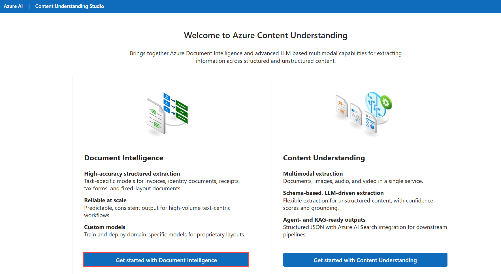
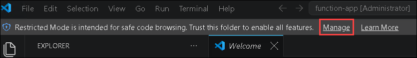
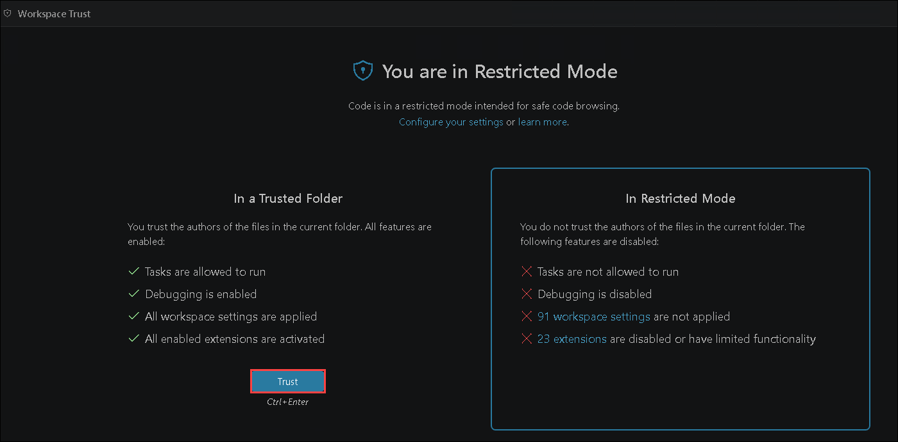
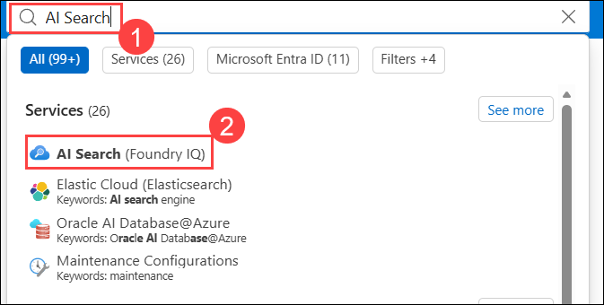
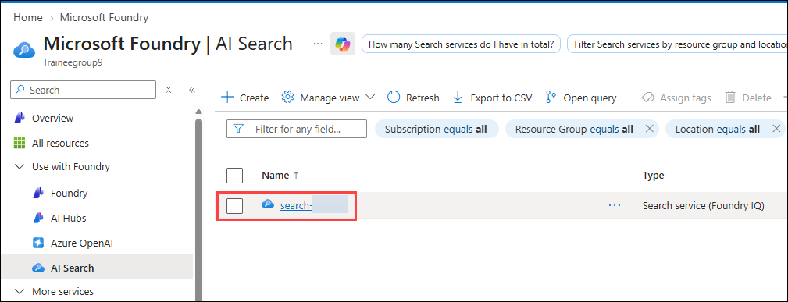
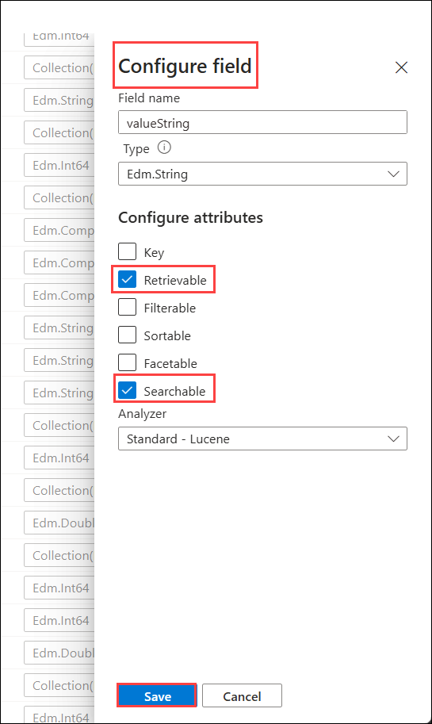
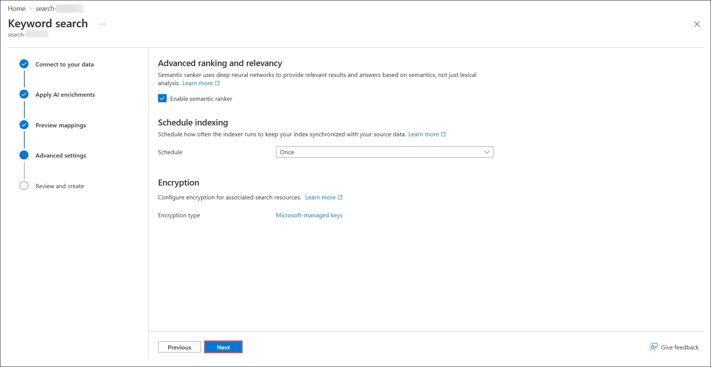
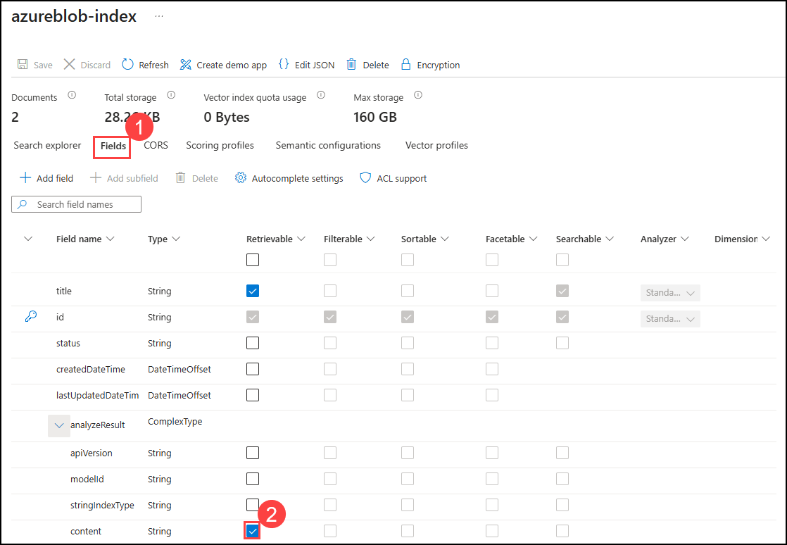

# Lab 01: Automate Document Processing using Azure AI Document Intelligence

### Estimated Duration: 120 Minutes

## Scenario

Contoso processes a large volume of invoices in PDF format and wants to reduce the manual effort involved in extracting key information from these documents. The company needs an automated solution that can identify important invoice details, such as the Organization and Address, and make the extracted information available for further analysis and search.

You will create a custom extraction model by uploading and labeling sample invoices, train the model using the template-based approach, and test it against new documents to verify the extracted information.

## Overview

In this lab, you will explore how Azure simplifies document processing by automating data extraction and analysis. Using Azure AI Document Intelligence, you'll train models to extract information from documents such as PDFs, images, and forms. You'll also integrate Azure Function Apps to enable scalable, programmatic processing of documents.

## Architecture Diagram

   

## Lab Objectives

You will be able to complete the following tasks:

- Task 1: Creating a Document Intelligence Resource
- Task 2: Train and Label data
- Task 3: Creation of Function App
- Task 4: Run the Function App
- Task 5: Working with AI Search (Foundry IQ)

## Task 1: Creating a Document Intelligence Resource

In this task, you will set up the Document Intelligence environment in Azure so you can build and train a custom document extraction model. It creates a project in Document Intelligence Studio, connects it to the correct Azure resource, and links a storage location for training data. By the end, you have a fully configured project ready for model training.

1. In the Azure portal, enter **Document intelligence (1)** in the top search bar and select **Document intelligences (2)** from the Services list.

   

1. On the **Microsoft Foundry | Document intelligence page**, navigate to **document-intelligence-<inject key="Deployment ID" enableCopy="false"/>** to open it.

   

1. In the **Overview** pane of the resource, scroll down to the **Get Started** section and click **Go to Document Intelligence Studio**. This opens the studio in a new browser tab, where you will build and train your custom model.

   

   >**Note:** If prompted, sign in using the same credentials you used to log in to Azure.

1. On the **Welcome to Azure Content Understanding page**, select **Get started with Document Intelligence**.

   

1. On the **Document Intelligence Studio** home page, scroll down to the **Custom models** section and click **Get started** under Custom extraction model. Custom extraction models allow you to train Document Intelligence to recognize fields that are specific to your own documents, such as the invoice fields used in this lab.

   

   >**Note:** If prompted, log in using the below Azure credentials.

1. On the **Sign in** tab, you will see the login screen. Enter the following email/username, and click on **Next (2)**. 

   * **Email/Username:** <inject key="AzureAdUserEmail"></inject> **(1)**
   
      
     
1. Now enter the following password and click on **Sign in (2)**.
   
   * **Password:** <inject key="AzureAdUserPassword"></inject> **(1)**
   
      

1. Under the **My Projects** blade, click on **+ Create a project**. A project stores your training documents, field labels, and trained models in one place.

   .png)

1. Under **Enter project details**, provide the following details, then click **Continue (3)**.

   - Project name: **testproject** **(1)**.
   - Description: **Custom model project** **(2)**.

     

1. Under **Configure service resource**, you will link the project to your **Document Intelligence** resource, which provides the compute and API access needed for training. Provide the following details, then click **Continue (5).**

   - Subscription: Select your **Default Subscription** **(1)**.
   - Resource group: **OpenAI-<inject key="Deployment ID" enableCopy="false"/>** **(2)**.
   - Document Intelligence or Cognitive Service Resource: Select **document-intelligence-<inject key="Deployment ID" enableCopy="false"/>** **(3)**.
   - API version: Select **2024-11-30 (4.0 General Availability)** **(4)**.

     

      >**Note**: Please ignore the error that appears when selecting Document Intelligence or Cognitive Service Resource. Since we are using the **Template** model training approach, this error does not impact the workflow.

1. Under **Connect training data source**, you will point the project to the blob container that holds your training documents. Enter the following details and click on **Continue (5).**

   - Subscription: Select your **Default Subscription** **(1)**.
   - Resource group: **OpenAI-<inject key="Deployment ID" enableCopy="false"/>** **(2)**.
   - Storage account: Select **storage<inject key="Deployment ID" enableCopy="false"/>** **(3)**.
   - Blob container: **analysis** **(4)**.
   
        

1. Review the project configuration details on the summary page and click **Create project**. Once the project is created, you will be taken directly to the labeling workspace.

     

## Task 2: Train and Label data

In this task, you will upload and label training documents to create a custom model, then train and test the model using labeled invoice data.

1. In the Label data section, click **Browse for files** to upload your training documents.

     

   >**Note:** If the information pop-up appears on the screen (such as Upload documents or Let us know how we're doing), please close the pop-up by clicking the **X** before continuing with the next step.

1. In the file explorer, enter the path `C:\LabFiles\Train` **(1)** and press **Enter**, select all **PDF files (2)** (Invoice_1 to Invoice_5) in the folder, then click **Open (3)**.

   .png)

1. Once the files are uploaded, choose **Run now** in the pop-up window under **Run layout**. This runs the built-in layout analysis on your documents, detecting all text, lines, and words so that you can label them in the next steps.

     

1. Click **+ Add a field (1)**, select **Field (2)**, enter **Organization (3)** as the field name, and press **Enter**. This defines the first custom field your model will learn to extract.

     

     

1. Now label the **Organization field** on the first document by following the steps below:

   - Select **Invoice_1.pdf (1)** from the left pane.

   - Highlight **Contoso (2)** in the document.

   - From the prompt, choose **Organization (3)** to label the field. 
   
   - A green checkmark will appear next to **Invoice_1.pdf** indicating successful labeling.

     

1. Click on **+ Add a field** **(1)**, select **Field** **(2)**, enter the field name as **Address** **(3)** and press **Enter** to define the second custom field.

     

   

1. Highlight the **address (1)** text in the document and assign it to the **Address (2)** field, just as you did for the Organization field.

   

1. Repeat **step 5** and **step 7** for the remaining documents (Invoice_2 to Invoice_5) so that both the **Organization** and **Address** fields are labeled on all five invoices. Consistent labeling across all training documents is essential for the model to learn the field positions accurately.

1. Once all the documents are labeled, click on **Train** in the top-right corner to begin training your custom model.

     

1. In the **Train a new model** window, enter **model (1)** as Model ID, **custom model (2)** as Model Description, choose **Template (3)** as Build Mode, and click **Train (4)**.

     

1. In the **Training in process** pop-up window, click on **Go to Models** to monitor the training progress.

   
   
1. Wait until the model status shows **Succeeded**. Training typically completes within a few minutes. Once it does, select the model **model (1)** you created and click on **Test (2)** to validate it against documents the model has never seen before.

    

1. On the **Test model** window, click on **Browse for files**. 

     

1. On the file explorer, enter the path `C:\LabFiles\Test` **(1)**, press **Enter**, select the test PDF files **Invoice_6 and Invoice_7 (2)**, and click **Open (3)** to open the files.

      

1. Once uploaded, select a test document **(1)** and click **Run analysis (2)**. On the right-hand side, you will see the detected fields **Organization** and **Address** along with their confidence scores, which indicate how certain the model is about each extraction. Higher scores mean more reliable results.

   
   
## Task 3: Creation of Function App

In this task, you will be using Azure Functions to process documents that are uploaded to an Azure blob storage container. This workflow extracts table data from stored documents using the Document Intelligence layout model and saves the data in a JSON file in Azure.
   
1. Open **Visual Studio Code** on the **Lab VM** by double-clicking the icon on the desktop.

   

   >**Note:** If any pop-up appears, **Continue without signing in** and close the pop-up window.

1. In Visual Studio Code, navigate to the **File (1)** from the top menu bar and select **Open Folder... (2)**.

   

1. Now, navigate to `C:/Labfiles` **(1)** and select **function-app (2)** folder and then click on **Select Folder (3)**. This folder will hold your Azure Functions project.

   

1. From the top navigation bar, click **Manage**.

   

1. Then, in the **You are in Restricted Mode** pop-up, click **Trust**. This allows Visual Studio Code to fully load and run the project files.

   

1. Select the **Azure symbol (1)** from the left pane, and click on **function-app icon (2)** and click **Create Function... (3)** This launches a guided wizard that scaffolds a new Azure Functions project for you.

   

1. You'll be prompted to configure several settings. Provide the following values as each prompt appears:

   - Select the folder → choose **function-app**.

     
     
   - Select a language → choose **Python**. Your function code will be written in Python.

     

   - Select a Python interpreter to create a virtual environment → select **python 3.11.9**. A virtual environment keeps the project's dependencies isolated from the rest of the system.
     
     

   - Select a template for your project's first function → choose **Blob trigger** and give the trigger a name or accept the default name. Press **Enter** to confirm. A blob trigger runs your function automatically whenever a file is added to a storage container.

     

     

   - The path within your storage container that the trigger will monitor → type **input** and press **Enter**. This means any file uploaded to the input container will trigger the function.

     

   - Select the app setting → choose **+ Create new local app setting** from the dropdown menu. This stores the storage connection details in your local settings file.

     

   - Click on **Sign in to Azure**.

     

   - Click on **Allow** if prompted. This will navigate to the Azure Portal and select your Azure Account.

     .png)

     - Enter Email: <inject key="AzureAdUserEmail" enableCopy="true"></inject> **(1)** and click **Next (2)**.

         

     - Enter Temporary Access Pass:: <inject key="AzureAdUserPassword"></inject> **(1)** and click **Sign in (2)**.

         

     - In the pop-up window, select **No, this app only**.

         

         >**Note:** If prompted, select subscription → choose the **Default Subscription**.

   - Select a storage account type for development → choose **Use Azure Storage for remote storage** and select **storage<inject key="Deployment ID" enableCopy="false"/>** → then select the name of the storage **input** container. Press **Enter** to confirm.
  
     >**Note:** If you are unable to select **Use Azure Storage for remote storage** and see "No subscription found", please reperform Steps 5–6 (including all sub-steps). After completing them again, you should be able to see Use Azure Storage for remote storage.

     

     

      >**Note:** If prompted, select how you would like to open your project → choose **Open the project in the current window** from the dropdown menu.

1. In VS Code, from the **Explorer (1)** in the left pane, navigate to the **requirements.txt (2)** file. This file defines the Python dependencies your function needs, including the Azure Storage SDK for writing results to blob storage and the `requests` library for calling the Document Intelligence API. Add the following **Python packages (3)** to the file and press `Ctrl + S` to save:
   
      ```
      cryptography
      azure-functions
      azure-storage-blob
      azure-identity
      requests
      pandas
      numpy
      ```
      

1. Click the **ellipsis (⋯) (1)** from the top menu bar, go to **Terminal (2)**, and select **New Terminal (3)** to launch the terminal.

      

1. Run the command below and press **Enter** to install all of the required packages into your project's virtual environment.

    ```
   pip install -r requirements.txt
    ```

      

1. Open the **local.settings.json (1)** file and replace its contents with the **configuration (2)** provided below, then press `Ctrl+S` to save. This file holds the settings your function uses when running locally, including the connection string it needs to reach your Azure Storage account.

      ```
      {
        "IsEncrypted": false,
        "Values": {
          "AzureWebJobsStorage": "<inject key="connectionString" enableCopy="false"/></inject>",
          "FUNCTIONS_WORKER_RUNTIME": "python",
          "AzureWebJobsFeatureFlags": "EnableWorkerIndexing",
          "storage<inject key="Deployment ID" enableCopy="false"/>_STORAGE": "<inject key="connectionString" enableCopy="false"/></inject>",
          "AzureWebJobsSecretStorageType": "Files"
        }
      }
      ```

   

1. Open the **function-app.py (1)** file and add the following **import statements (2)** by replacing the existing ones. These bring in the libraries needed for logging, blob storage access, HTTP requests, and data handling:

      ```
      import logging
      from azure.storage.blob import BlobServiceClient
      import azure.functions as func
      import json
      import time
      from requests import get, post
      import os
      import requests
      from collections import OrderedDict
      import numpy as np
      import pandas as pd
      ```

      
   
1. Replace the main function by copying and pasting the code provided below. This code defines the blob trigger — the entry point that fires whenever a file arrives in the monitored container — and logs the details of the incoming blob. Then replace the **path (1)** and **connection (2)** placeholders with the specified values.

      ```
      app = func.FunctionApp()
   
      @app.blob_trigger(arg_name="myblob", path="<container-name>", connection="<storage-account-name>_STORAGE")
   
      def blob_trigger(myblob: func.InputStream):
         logging.info(f"Python blob trigger function processed blob"
                      f"Name: {myblob.name}" 
                      f"Blob Size: {myblob.length} bytes")
      ``` 
      - path = **input** 
      - connection = **storage<inject key="Deployment ID" enableCopy="false"/>_STORAGE**

         

1. Add the following code block that calls the **Document Intelligence Analyze Layout API** on the uploaded document. This sends the blob's contents to your Document Intelligence resource for analysis. Replace the placeholders as follows:

   - Replace **Your Document Intelligence Endpoint** : **<inject key="documentIntelligenceEndpoint"></inject>** **(1)**

   - Replace **Your Document Intelligence Key** : **<inject key="documentIntelligenceKey"></inject>** **(2)**.

   - Replace `<model-name>` with **model (3)**.

      ```
         # This is the call to the Document Intelligence endpoint
         endpoint = "Your Document Intelligence Endpoint"
         apim_key = "Your Document Intelligence Key"
         post_url = endpoint + "/formrecognizer/documentModels/<MODEL-NAME>:analyze?api-version=2023-07-31"
         source = myblob.read()
      
         headers = {
         # Request headers
         'Content-Type': 'application/pdf',
         'Ocp-Apim-Subscription-Key': apim_key,
            }
      ```

      
   
1. Next, add the code below to submit the document for analysis and retrieve the returned data. Because the Layout API is **asynchronous**, the code first submits the request, waits briefly, and then polls the operation URL for the completed results.

      ```
         resp = requests.post(url=post_url, data=source, headers=headers)
      
         if resp.status_code != 202:
            print("POST analyze failed:\n%s" % resp.text)
            quit()
         print("POST analyze succeeded:\n%s" % resp.headers)
         get_url = resp.headers["operation-location"]
         
         wait_sec = 25
         time.sleep(wait_sec)
         # The layout API is async therefore the wait statement
         resp = requests.get(url=get_url, headers={"Ocp-Apim-Subscription-Key": apim_key})
         resp_json = json.loads(resp.text)
         status = resp_json["status"]
         
         if status == "succeeded":
            print("POST Layout Analysis succeeded:\n%s")
            results = resp_json
         else:
            print("GET Layout results failed:\n%s")
            quit()
         
         results = resp_json
      ```

      

1. Add the following code to connect to the Azure Storage **output** container and save the analysis results. The code serializes the results to JSON and uploads them as a new blob named after the original document.
   
    - Replace **{storage-connection-string}** : **<inject key="connectionString" enableCopy="false"/></inject>**

      ```
         # This is the connection to the blob storage, with the Azure Python SDK
         blob_service_client = BlobServiceClient.from_connection_string("{storage-connection-string}")
         container_client=blob_service_client.get_container_client("output")
      
         # Assuming `results` is your JSON data
         data = json.dumps(results)

         # Create a new blob and upload the data
         blob_name = myblob.name + ".json"
         blob_client = container_client.get_blob_client(blob_name)
         blob_client.upload_blob(data, overwrite=True)
      ```

      

1. Please verify that your final code matches the complete function shown below.

      ```
      import logging
      from azure.storage.blob import BlobServiceClient
      import azure.functions as func
      import json
      import time
      from requests import get, post
      import os
      import requests
      from collections import OrderedDict
      import numpy as np
      import pandas as pd
      
      app = func.FunctionApp()
      
      @app.blob_trigger(arg_name="myblob", path="<input container>", connection="storage<DID>_STORAGE") 
      
      def blob_trigger(myblob: func.InputStream):
         logging.info(f"Python blob trigger function processed blob"
                      f"Name: {myblob.name}"
                      f"Blob Size: {myblob.length} bytes"
         )
      
         # This is the call to the Document Intelligence endpoint
         endpoint = "<document-intelligence-endpoint>"
         apim_key = "<document-intelligence-key>"
         post_url = endpoint + "/formrecognizer/documentModels/<model-name>:analyze?api-version=2023-07-31"
         source = myblob.read()
         
         headers = {
            # Request headers
            'Content-Type': 'application/pdf',
            'Ocp-Apim-Subscription-Key': apim_key,
                  }
         
         resp = requests.post(url=post_url, data=source, headers=headers)
      
         if resp.status_code != 202:
            print("POST analyze failed:\n%s" % resp.text)
            quit()
         print("POST analyze succeeded:\n%s" % resp.headers)
         get_url = resp.headers["operation-location"]
         
         wait_sec = 25
         time.sleep(wait_sec)
         # The layout API is async therefore the wait statement
         resp = requests.get(url=get_url, headers={"Ocp-Apim-Subscription-Key": apim_key})
         resp_json = json.loads(resp.text)
         status = resp_json["status"]
         
         if status == "succeeded":
            print("POST Layout Analysis succeeded:\n%s")
            results = resp_json
         else:
            print("GET Layout results failed:\n%s")
            quit()
         
         results = resp_json
      
         # This is the connection to the blob storage, with the Azure Python SDK
         blob_service_client = BlobServiceClient.from_connection_string("{storage-connection-string}")
         container_client=blob_service_client.get_container_client("output")
      
         # Assuming `results` is your JSON data
         data = json.dumps(results)
      
         # Create a new blob and upload the data
         blob_name = myblob.name + ".json"
         blob_client = container_client.get_blob_client(blob_name)
         blob_client.upload_blob(data, overwrite=True)
      ```
      > **Note:** Please make sure the indentation of the code remains unchanged and proper to run the code successfully

1. Under the **.vscode (1)** folder, open **launch.json (2)**, replace the entire contents with the code given below, and press **Ctrl+S** to save. This configures the debugger so the function can be launched locally in the next task.

      ```
      {
         "version": "0.2.0",
         "configurations": [
            {
                  "name": "Python Debugger: Current File",
                  "type": "debugpy",
                  "request": "launch",
                  "program": "${file}",
                  "console": "integratedTerminal"
            },
            {
                  "name": "Attach to Python Functions",
                  "type": "debugpy",
                  "request": "attach",
                  "connect": {
                     "host": "localhost",
                     "port": 9091
                  },
                  "preLaunchTask": "func: host start"
            }
         ]
      }
      ```

      

## Task 4: Run the Function App

In this task, you will run the function in VS Code, which uploads test invoices to the input container of the Azure Storage account to trigger the function. Afterwards, verify the output JSON files in the output container to confirm successful document analysis.

1. In Visual Studio Code, click the **ellipsis (...) icon (1)** in the top menu, expand **Terminal (2)**, and select **New Terminal (3)** from the dropdown to launch the terminal.

   

1. Press **Ctrl + F5** to execute the function. This starts the Azure Functions host locally, which begins listening for new blobs in the **input** container.

   > **Note:** If a error appears, follow the steps below:

   - Click on **Debug Anyway**

      .png)

   - Then in the next pop-up, choose **Install debugpy Extension**. This will take you to the extension page.

      2.png)

   - Click **Install** to set up the **Python Debugger**. This helps you run your Python program step-by-step and find errors or unexpected behavior.

      

   - Press **Ctrl + F5** one more time to execute the function.

1. Once the function is running successfully, navigate back to the **Azure Portal** to trigger it by uploading an input file. Keep Visual Studio Code open in the background so you can watch the function logs later.

   

   > **Note:** If any pop-up occurs, close it.

      

1. In the search bar, search for **Storage Account (1)** and select it under **Services (2)**.

   

1. Select **storage<inject key="Deployment ID" enableCopy="false"/>** from the Storage accounts blade.

   

1. From the left navigation pane, expand **Data storage (1)**, select **Containers (2)**, then open the **input (3)** container. This is the container your function is monitoring.

   
   
1. In the input container, click on **Upload (1)** button, in the **Upload blob** pop-up window click on **Browse for files (2)**.

   

1. Navigate to `C:\LabFiles\Test` **(1)**, select **Invoice_6 and Invoice_7 (2)**, then click **Open (3)** to upload the files.

   
   
1. In the **Upload blob** pop-up window, click on the **Upload** button. As soon as these files land in the container, the blob trigger fires and your function starts analyzing them.

   

1. Navigate back to **VS Code** and verify the **logs** in the **Terminal**. You should see log entries confirming that the function was triggered and the analysis succeeded for each uploaded invoice.

1. Once the function app is triggered successfully, return to the **storage account** in the Azure portal.

   

1. From the left navigation pane, expand **Data storage (1)**, select **Containers (2)**, then open the **output (3)** container

   

1. In the **output** container, click on the **input** folder and verify that the **JSON** files analyzing the documents have been generated successfully. Each JSON file contains the full analysis results for the corresponding invoice, ready to be indexed in the next task.

   

>**Congratulations** on completing the Task! Now, it's time to validate it. Here are the steps:
> - Hit the Validate button for the corresponding task. If you receive a success message, you have successfully validated the lab. 
> - If not, carefully read the error message and retry the step, following the instructions in the lab guide.
> - If you need any assistance, please contact us at cloudlabs-support@spektrasystems.com.

<validation step="44d3193c-9401-4326-a2f5-067cf63f0c54" />

## Task 5: Working with AI Search (Foundry IQ)

In this task, you will connect Azure AI Search (Foundry IQ) to Blob Storage to index analyzed document data. You will configure the search index and indexer to make key fields like Organization and Address searchable and facetable, then verify the indexed data by running search queries.

1. In the Azure portal, enter **AI Search (1)** in the top search bar and select **AI Search (Foundry IQ) (2)** from the Services list.

      
   
1. In the **Microsoft Foundry | AI Search** tab, select **search-<inject key="Deployment ID" enableCopy="false"/>**.

      
   
1. On the Overview page of **search-<inject key="Deployment ID" enableCopy="false"/>**, click on **Import data** from the top menu bar to launch the guided import wizard.

      

1. From **Choose a data source (1)**, select **Azure Blob Storage (2)**, since your analyzed JSON files are stored in a blob container.

      

1. After selecting the Azure blob storage , select **Keyword search**

   

1. Provide the following values to connect the wizard to your output data and click on **Next (6)**.
   
      - Subscription: Select the **Default subscription (1)**.
      - Storage account: storage <inject key="Deployment ID" enableCopy="false"/> **(2)** 
      - Blob container: **output (3)**
      - Blob folder: **input (4)**
      - Parsing Mode: **JSON (5)**

        

1. On the **Apply AI Enrichments (Optional)** page, no additional enrichment is needed for this lab, so click **Next** to Preview Mappings at the bottom. 
     
      

1. On the **Preview Mappings** page, click on the **ellipsis (...) (1)** and then select **Configure field (2)**. This is where you control how each field behaves in the index.

      

1. Ensure that all fields are marked as **Retrievable (1)** and **Searchable (2)**, and click on **Save (3)**. **Retrievable** means the field's value is returned in search results, and **Searchable** means the field's text is included in full-text search.

      

1. On the **Preview Mappings** page, expand **analyzeResult (1)** > **documents (2)** > **fields (3)** to reach the custom fields extracted by your model. Then expand **Address (4)** and locate its sub-fields **type, valueString, and content (5)**; do the same for **Organization (6)** and its sub-fields **type, valueString, and content (7)**.

   

   
      
1. For each of the sub-fields identified in the previous step, click on the **ellipsis (...) (3)**, select **Configure field (4)**, enable the **Retrievable** and **Searchable** options, and click **Save**. Take a reference from the given image, which shows the configuration for **Address (1)** > **valueString (2)** > **Configure field (4)**. After configuring the fields for both **Address** and **Organization**, click on **Next**.

   >**Note:** Configure **Retrievable** and **Searchable** for confidence , bounding regions as well for all fields.
   
   

   

1. Keep the **Advanced settings** at their default values and click on **Next**.

   

1. On the **Review and Create** page, enter the Objects name prefix as **azureblob-index (1)** and click on **Create (2)** at the bottom. This creates the data source, index, and indexer in a single operation, and the indexer immediately runs to ingest your JSON files.

   

1. From the left navigation pane, expand **Search management (1)**, select **Indexes (2)**, then click **azureblob-index (3)** to open the newly created index.

      

1. In the **azureblob-index**, click on the **Search** button next to the search bar. Leaving the search box empty returns all indexed documents.

      

1. Verify that the analyzed document appears in the search results. This confirms that the indexer has successfully ingested the JSON output produced by your function.

      

1. Search for `fields` in the returned document and verify that the **Organization** and **Address** fields, created during training, have been correctly analyzed and indexed along with their extracted values.

      

      

1. In the **Fields (1)** tab of the index, make sure the **content** field's **Retrievable** option is **checked (2)**, and click **Save**. This ensures the full document content is available to applications that query the index, such as the web app you will deploy in the next lab.

   

## Summary

In this lab, you created a Document Intelligence resource and trained a template-based model by labeling sample documents. You then developed and deployed an Azure Function App to automate document processing and executed it to validate the workflow. Finally, you integrated the output with AI-powered search capabilities to explore enriched document insights.

### You have successfully completed the lab. Now, click on **Next >>** from the lower right corner to proceed on to the next lab.


