# Lab 02: Utilize your Data Set using OpenAI

### Estimated Duration: 120 Minutes

## Overview

In this lab, you will use Azure OpenAI to interact with custom data through the ChatGPT model. You'll upload data via the Microsoft Foundry portal, configure query handling, and deploy the model as a web app. Interactions will be stored in Azure Cosmos DB, providing traceability and persistence. This lab offers hands-on experience in customizing and deploying AI solutions with Azure.

## Architecture Diagram


## Lab Objectives

You will be able to complete the following tasks:

- Task 1: Navigate to Azure OpenAI Playground
- Task 2: Upload your own data
- Task 3: Interact with Azure OpenAI ChatGPT LLM using your own data

## Task 1: Navigate to Azure OpenAI Playground

In this task, you will open the Azure OpenAI resource in the Azure portal. It navigates to the Microsoft Foundry portal from the resource page. If the direct option is missing, it provides an alternate navigation method to reach Microsoft Foundry.

1. In the Azure portal, search for **Foundry (1)** in the search bar and select **Microsoft Foundry (2)** from Services.

   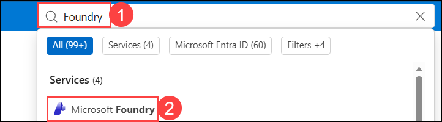

1. In the **Microsoft Foundry | Foundry** tab, click **Foundry (1)**, and select **OpenAI-<inject key="Deployment ID" enableCopy="false"/> (2)**.

   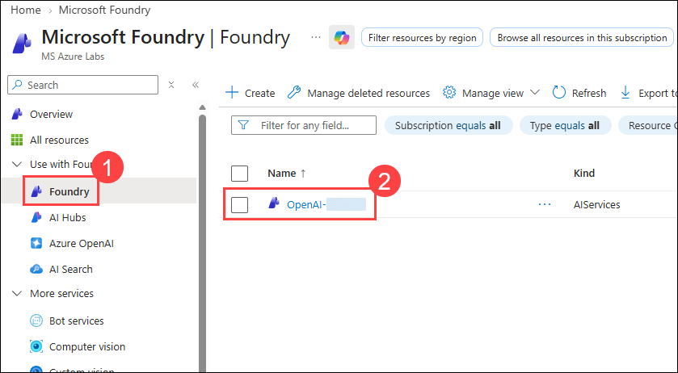

1. On the **Microsoft Foundry** page, click **Go to Foundry portal** to proceed to the Microsoft Foundry interface

   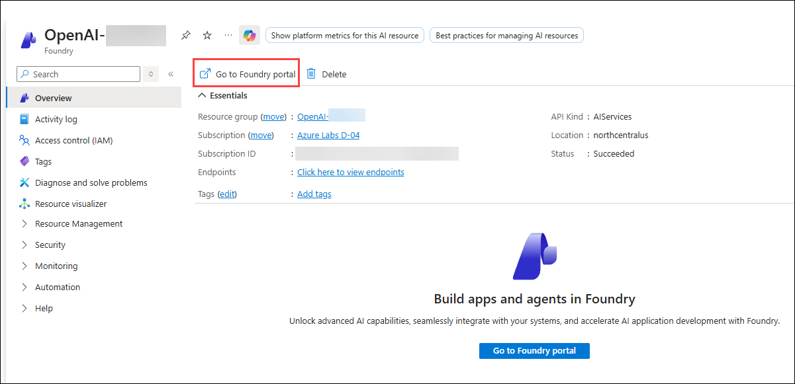

## Task 2: Upload your own data

In this task, you will upload Porsche's owner manuals (Taycan, Panamera, Cayenne) to Azure OpenAI Studio for use in a custom chat model.

1. Once you launch the **Foundry Portal**, click **Build**.

   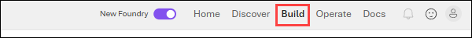

1. Select **Deployments**, and click on the **Model**. 

   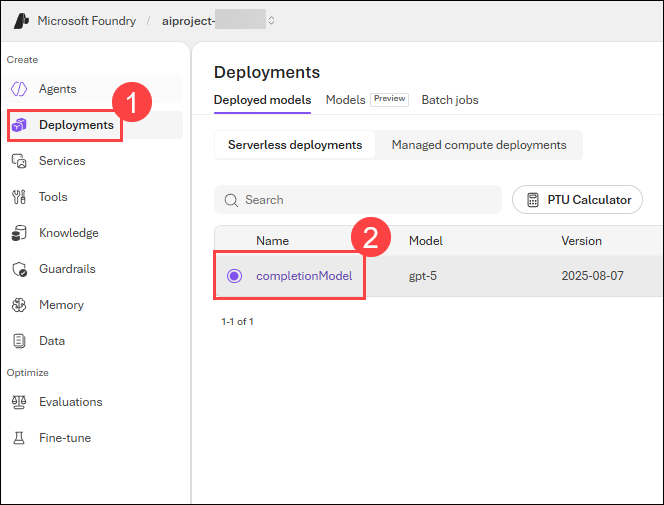

1. Click **Upload files**.

   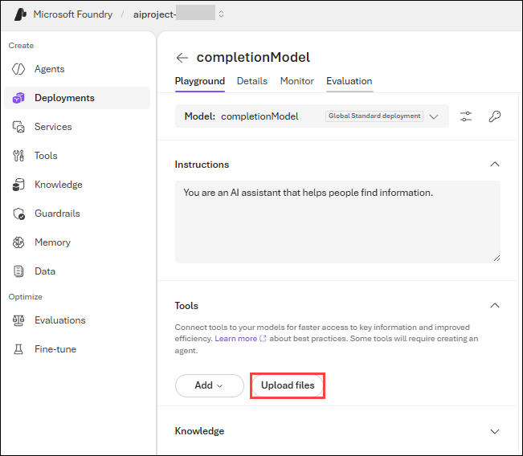

1. For the **Index option**, select **Create a new index (1)**. In the Vector index name field, enter **aoaiworkshop (2)**, and then click **browse for files (3).**

   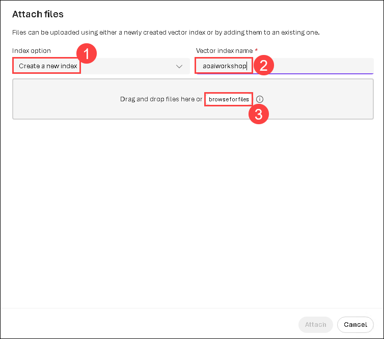

1. Navigate to the path `C:\LabFiles\Data\Lab 2` **(1)** and press Enter. Select **all the PDF files (2)** in this folder, then click **Open (3)** to upload them.

   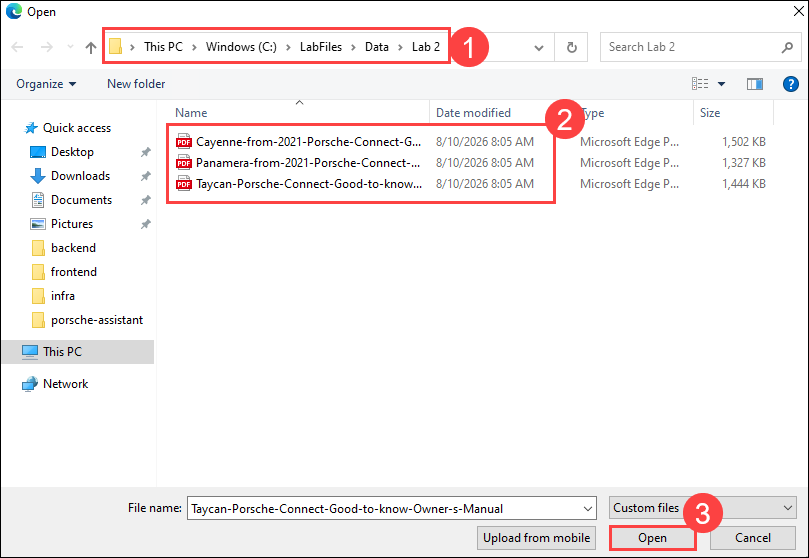

1. Click **Attach**.

   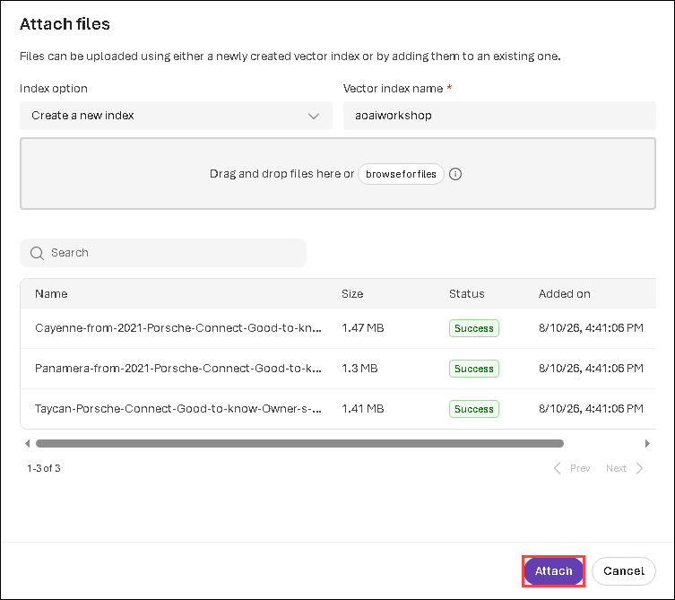

## Task 3: Interact with Azure OpenAI ChatGPT LLM using your own data

In this task, you will upload custom data to Microsoft Foundry and interact with an Azure OpenAI ChatGPT model. You will customize the system message, test prompt responses, adjust model parameters, and deploy the chatbot as a web app via the Azure portal. The task also includes verifying conversation logging in Azure Cosmos DB and provides steps to troubleshoot deployment issues if needed.

1. Under the **Chat Session** pane, begin testing your prompts by entering queries as shown below:

    ```
    How to operate Android Auto in the Porsche Taycan? give step-by-step instructions
    ```

      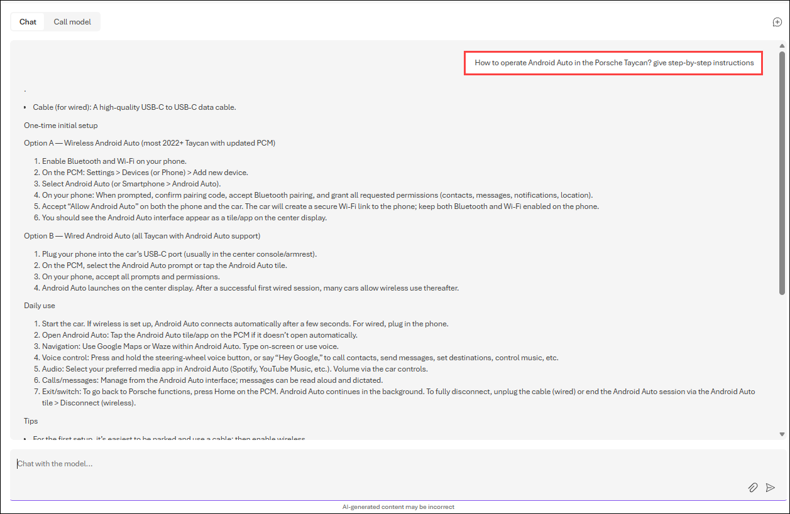

1. Customize your bot's responses by updating the **Instructions**.

    ```
    Your name is Alice. You are an AI assistant that helps people find information about Porsche cars. Your responses should not contain any harmful information 
    ```

      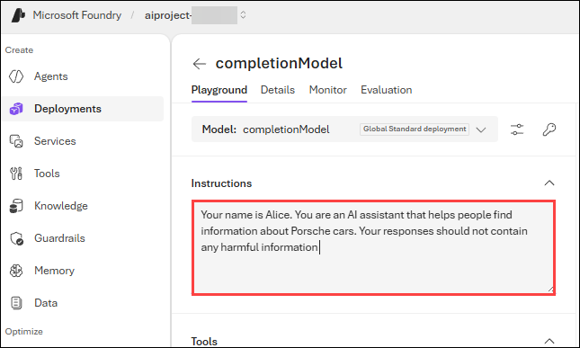

1. Under the **Chat Session** pane, begin testing your prompts by entering queries as shown below:

    ```
    What is your name?
    ```
   
   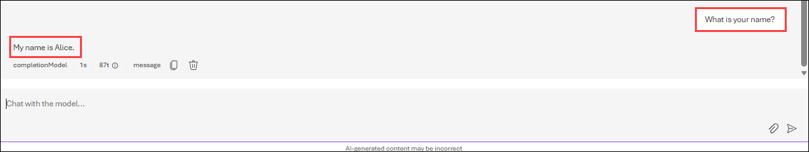

1. In the **Playground** pane, click on the **Parameters** and expand it, experiment with different settings to observe how they affect the model's behavior.

    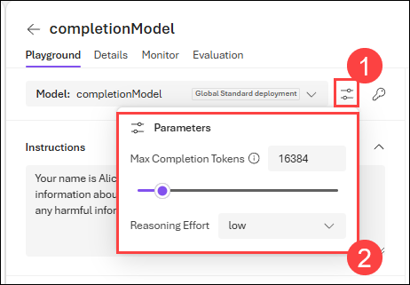

1. In Visual Studio Code, navigate to the **File (1)** from the top menu bar and select **Open Folder... (2)**.

   

1. Now, navigate to `C:/Labfiles` **(1)** and select **porsche-assistant (2)** folder and then click on **Select Folder (3)**.

   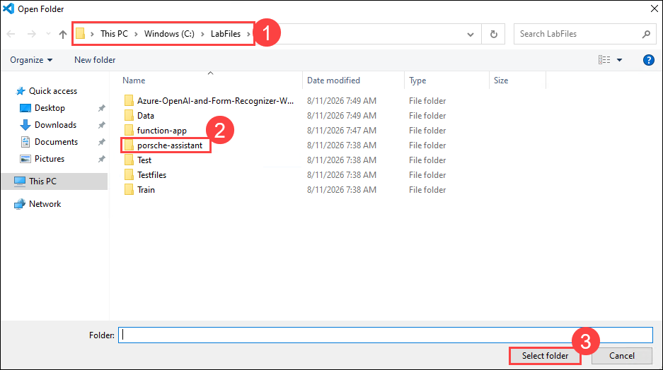

1. After uploading the folder, the files contained within it will be displayed.

   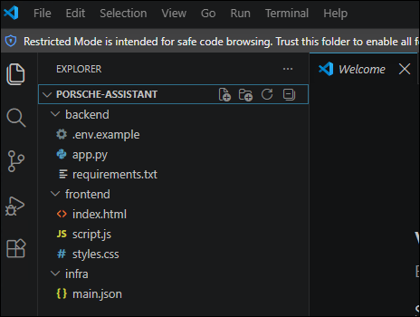

1. From the top navigation bar, click **Manage**.

   

1. Then, in the **You are in Restricted Mode** pop-up, click Trust.

   

1. Navigate back to **Azure Portal**, and go to your Foundry resource **OpenAI-<inject key="Deployment ID" enableCopy="false"/>** to get the required values needed for the script.

   - Navigate to your **Foundry** resource

     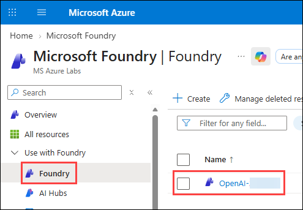

   - Under **Resource Management (1)**, click **Keys and Endpoint (2)**, and copy the **Key 1 (3)**, and the **API endpoint (4)**, and save it in a **Notepad**.

     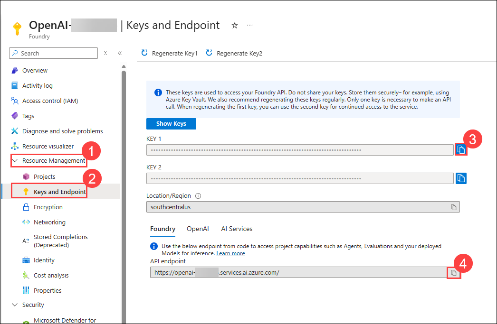

   - Now, go to **Overview** and click **Go to Foundry portal**.

     

   - In the **Foundry portal**, copy the **API key (1)**, **Azure OpenAI endpoint (2)**, and scroll down to copy the **model name (3)**, and save it in a **Notepad.**

     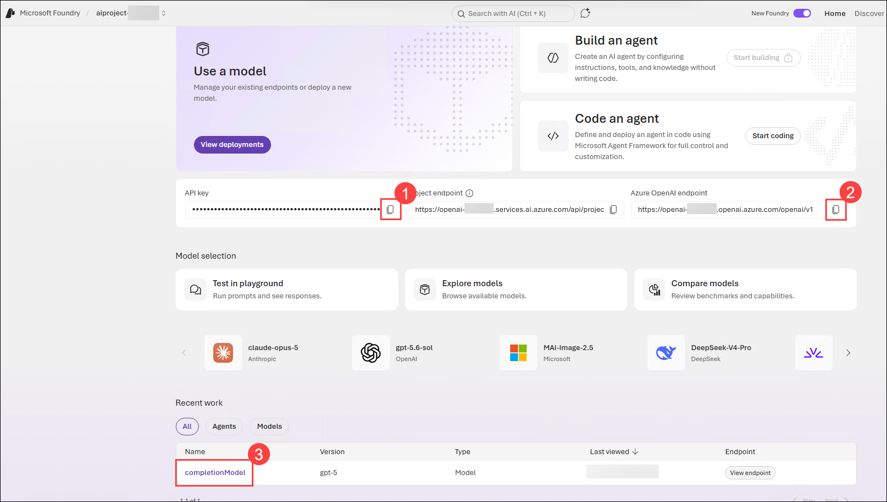 

1. In the **Microsoft Foundry | AI Search** page, click **AI Search (1)**, and select **search-<inject key="Deployment ID" enableCopy="false"/> (2)**.

   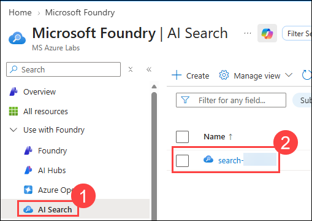

1. In the **Overview (1)** page, copy the **URL (2)**, and save it in a **Notepad**.

   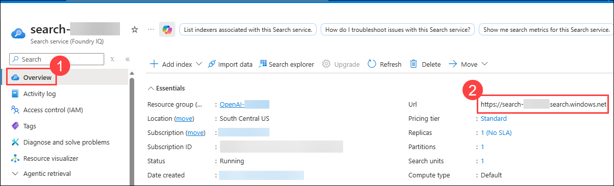

1. Scroll down, and under **Security + networking**, click **Keys (1)**, copy the **Key (2)**, and save it in a **Notepad**.

   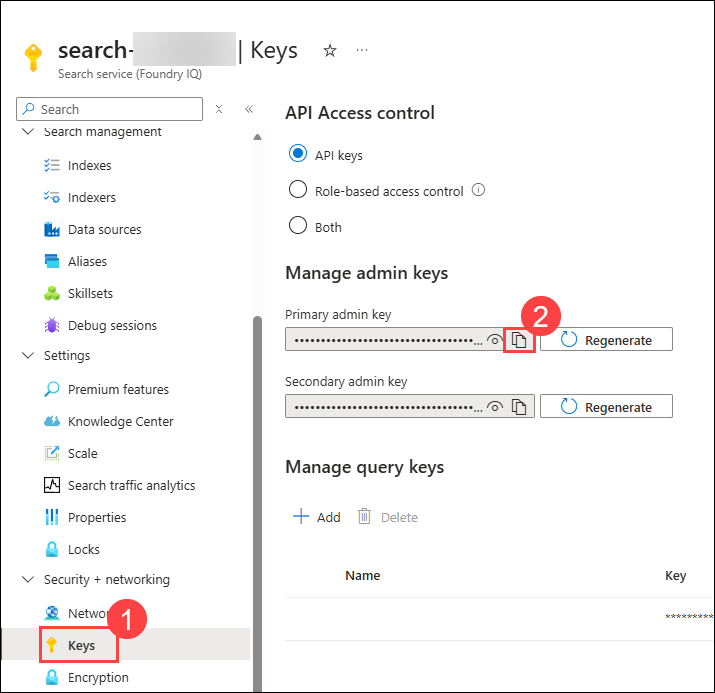

1. Navigate back to **Visual Studio Code** and launch a new terminal.

1. Click the **ellipsis (⋯) (1)** from the top menu bar, go to **Terminal (2)**, and select **New Terminal (3)**.

      

1. In the new terminal, copy the command below to login to Azure.

   ```
   az login
   ```

   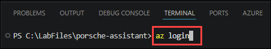

   >**Note**: Minimize all the applications to **Sign in**.

1. Select **Work or school account (1)**, and click **Continue (2)**.

   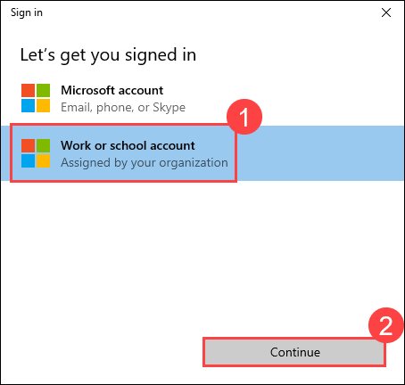

1. On the **Sign in to Microsoft Azure** tab, you will see the login screen. Enter the following email/username, and click on **Next (2)**. 

   * **Email/Username:** <inject key="AzureAdUserEmail"></inject> **(1)**
   
      
     
1. Now enter the following password and click on **Sign in (2)**.
   
   * **Enter Temporary Access Pass:** <inject key="AzureAdUserPassword"></inject> **(1)**
   
      

1. On the **Sign in to all apps and websites on this device?**, click **No, this app only**.

      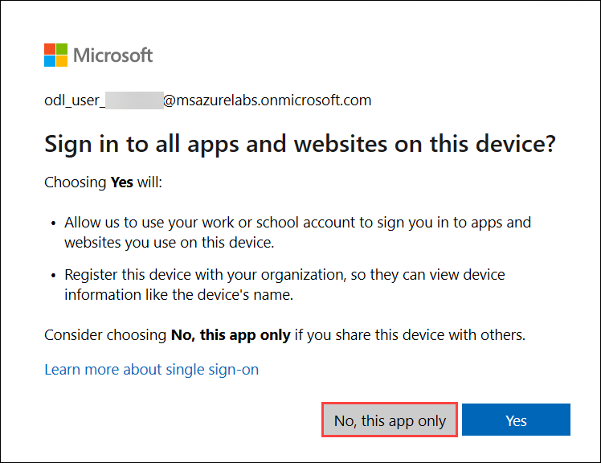

1. In the Visual Studio code page, press **Enter** to select default subscription.

      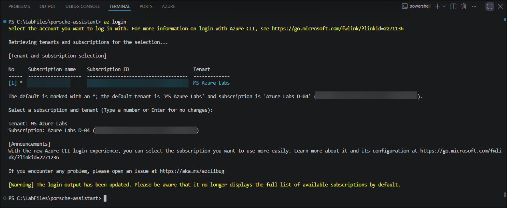
     
1. In the **Chat playground**, click on **Deploy (1)** in the top menu bar and select **…as a web app (2)** from the drop-down menu.

   

1. Add the following details and click on **Deploy (7)**

   - Name: **webapp-<inject key="Deployment ID" enableCopy="false"/> (1)**
   - Subscription: Select the **Default subscription (2)**
   - Resource Group: Select **OpenAI-<inject key="Deployment ID" enableCopy="false"/>** **(3)**
   - Location: Select **<inject key="Region" enableCopy="false"/> (4)**
   - Pricing Plan: Choose **Standard (S1) (5)**
   - Check the box for **Enable chat history in the web app** **(6)**

     

     > **Note:** Wait for 10 minutes for the webapp to be deployed successfully.

1. In the Azure Portal, search for **App Services (1)** in the search bar and select **App Services (2)** from the **Services**. 

      

1. Select the **webapp-<inject key="Deployment ID" enableCopy="false"/> (1)** App Service.

      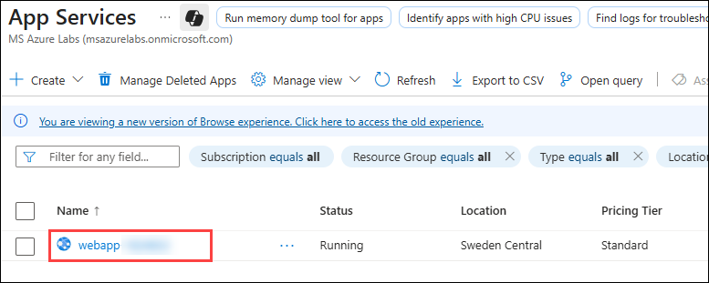
      
1. Click **Browse** from the top menu bar to open and verify that the web app is running successfully after deployment.

    
    
    

      > **Note:** If you see a blank screen, wait for some time and refresh the page.

      > **Note:** In cases of permissions asked, click on **Accept**.

      

      > **Note:** In case of an internal server error or **Chat history is not enabled** error, navigate back to the **Microsoft Foundry portal** and follow the steps below:

      

   - In the **Chat (1)** section under Chat playgrounds, click **Deploy (2)** in the top menu bar, then select **...as a web app (3)** from the drop-down menu.

       

   - Click on **Update an existing web app (1)**, select the **default subscription (2)**, then choose **webapp-<inject key="Deployment ID" enableCopy="false"/> (3)**. Check the box for **Enable chat copilot in web app (4)**, and finally, click **Deploy (5)**.
     
      .png)
     
   - Navigate to **App Services**, select **webapp-<inject key="Deployment ID" enableCopy="false"/>**, click on **Deployment (1)**, then select **Deployment Center (2)**. Go to the **Logs** tab and verify that the status is **Success (3)**.

      %20-%20Copy.png)
     
   - Click on **Browse** from the overview tab again.

      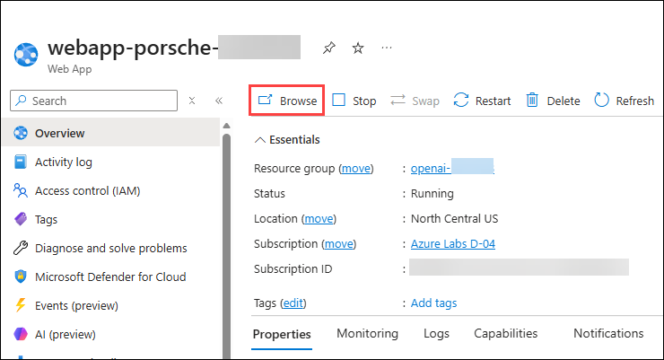

     >**Note:** If the internal server issue continues, restart the web app and then try accessing it. Please note that it may take some time to become available.
     
1. Interact with the chatbot by entering queries related to the documents you previously uploaded to verify its functionality.

    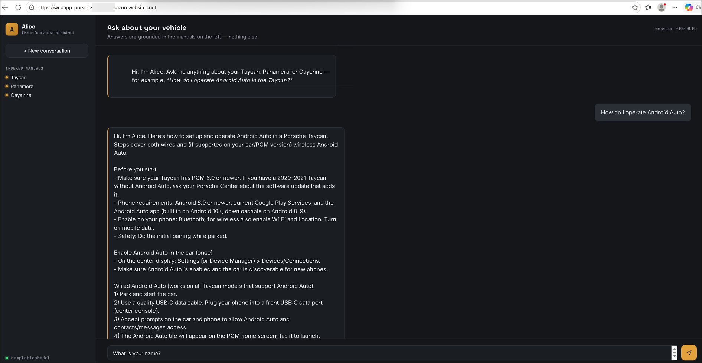

1. In the Azure Portal, search for **Azure Cosmos DB (1)** and select **Azure Cosmos DB (2)** from the **Services**.

    

1. Verify **cosmos-porsche-<inject key="Deployment ID" enableCopy="false"/>** has been created, then **select** it.
   
   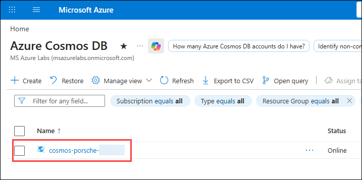

1. In the **cosmos-porsche-<inject key="Deployment ID" enableCopy="false"/>** instance, navigate to **Data Explorer (1)** within your Azure Cosmos DB account. Expand the **conversations (2)** container and selects **items (3)**. Confirm that the **conversation data (5)** from the web app is successfully recorded by reviewing the displayed **documents (4)**.

    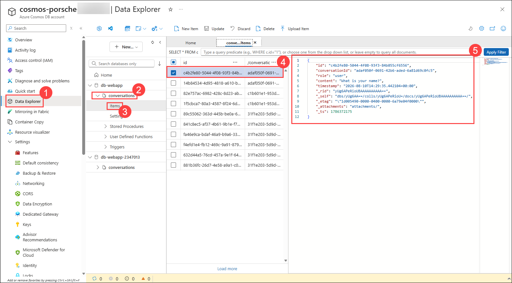

>**Congratulations** on completing the Task! Now, it's time to validate it. Here are the steps:
> - Hit the Validate button for the corresponding task. If you receive a success message, you have successfully validated the lab. 
> - If not, carefully read the error message and retry the step, following the instructions in the lab guide.
> - If you need any assistance, please contact us at cloudlabs-support@spektrasystems.com.

<validation step="ba1751b9-d16b-47ac-9282-a6ecc8cb4870" />
   
## Summary

In this lab, you accessed the Azure OpenAI Playground, uploaded your own dataset, and integrated it with the chat experience. You then interacted with the Azure OpenAI ChatGPT model to generate responses grounded in your uploaded data.

## You have successfully completed the Hands-on lab.

### Conclusion

By completing this lab, you gained hands-on experience with Azure Microsoft Foundry to extend ChatGPT with your own data. You configured the system to respond to domain-specific queries, deployed the model as a web application, and validated that all interactions were successfully logged in Cosmos DB. This exercise demonstrated how to build, deploy, and monitor a customized AI-powered solution end-to-end.
