# Lab 02: Utilize your Data Set using Microsoft Foundry

### Estimated Duration: 120 Minutes

## Scenario

Contoso is a global organization looking to use generative AI to provide employees and customers with quick, reliable access to information contained in its internal documents. The organization has a large collection of product manuals and technical documentation that users frequently need to search through to find specific information.

To improve access to this knowledge, Contoso wants to build an AI-powered assistant using Microsoft Foundry. The assistant should be able to understand user questions, retrieve relevant information from Contoso's custom documents, and provide natural-language responses based on the available content.

## Overview

This lab provides hands-on experience with Microsoft Foundry by connecting a ChatGPT model to a custom dataset. You will upload Porsche vehicle owner manuals, create a searchable index, configure the model to provide responses grounded in the uploaded content, and test the customized chat experience.

You will then configure and deploy a Porsche AI assistant as an Azure web application. The deployment integrates Microsoft Foundry, Azure AI Search (Foundry IQ), Azure App Service, and Azure Cosmos DB to provide a complete AI application workflow. Finally, you will verify that user conversations are successfully stored in Azure Cosmos DB.

## Architecture Diagram

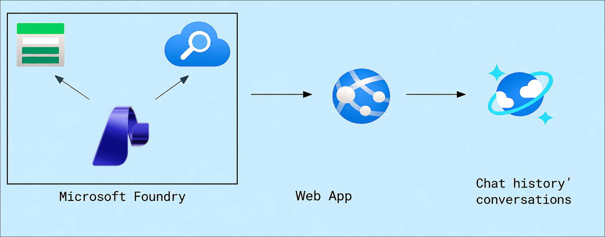

## Lab Objectives

You will be able to complete the following tasks:

- Task 1: Access the Microsoft Foundry Portal
- Task 2: Upload your own data
- Task 3: Interact with the Microsoft Foundry Chat Model Using Your Own Data

## Task 1: Access the Microsoft Foundry Portal

In this task, you will locate the pre-provisioned Microsoft Foundry resource in the Azure portal and launch the Microsoft Foundry portal from its resource page. The Foundry portal is the central workspace where you will manage model deployments, attach your own data, and test the chat experience throughout this lab.

1. In the Azure portal, search for **Foundry (1)** in the search bar and select **Microsoft Foundry (2)** from the **Services** list.

   

1. In the **Microsoft Foundry | Foundry** tab, click **Foundry (1)** from the left pane, and select the pre-created resource **OpenAI-<inject key="Deployment ID" enableCopy="false"/> (2)** to open it.

   

1. On the **Microsoft Foundry** resource page, click **Go to Foundry portal** to proceed to the Microsoft Foundry interface. The portal opens in a new browser tab.

   

## Task 2: Upload your own data

In this task, you will upload Porsche's owner manuals (Taycan, Panamera, and Cayenne) and attach them to your chat model deployment. Behind the scenes, the uploaded documents are chunked and indexed into a **vector index**, which allows the model to retrieve the most relevant passages when answering a question. This is what enables the model to respond with information from your documents instead of relying only on its general training knowledge.

1. Once you launch the **Foundry portal**, click **Build** from the top navigation.

   

1. Select **Deployments** from the left pane, and click on the **completionModel** deployment to open it.

   

1. In the playground for the deployment, click **Upload files**. This is where you attach your own data to the model.

   

1. For the **Index option**, select **Create a new index (1)**. In the **Vector index name** field, enter **aoaiworkshop (2)**, and then click **browse for files (3)**.

   

1. Navigate to the path `C:\LabFiles\Data\Lab 2` **(1)** in the address bar and press **Enter**. Select **all the PDF files (2)** in this folder — these are the Porsche owner manuals — then click **Open (3)** to upload them.

   

1. Click **Attach**. Foundry now processes the uploaded manuals and builds the **aoaiworkshop** vector index from their contents. Once complete, the model is connected to your data.

   

## Task 3: Interact with the Microsoft Foundry Chat Model Using Your Own Data

In this task, you will interact with the Foundry chat model using the data you uploaded, customize the assistant's behavior with instructions, and experiment with model parameters. You will then deploy the Porsche AI assistant end-to-end: provisioning the required Azure infrastructure with an ARM template, configuring and running the application locally, deploying it to Azure App Service, and finally verifying that user conversations are being logged in Azure Cosmos DB.

1. Under the **Chat Session** pane, begin testing your prompts by entering a query that can only be answered from the uploaded manuals, as shown below. Notice that the response is grounded in the Taycan owner manual rather than generic knowledge:

    ```
    How to operate Android Auto in the Porsche Taycan? give step-by-step instructions
    ```

      

1. Customize your bot's personality and behavior by updating the **Instructions**. Instructions (also known as the system message) define how the assistant introduces itself, what it should focus on, and the boundaries it must respect:

    ```
    Your name is Alice. You are an AI assistant that helps people find information about Porsche cars. Your responses should not contain any harmful information 
    ```

      

1. Under the **Chat Session** pane, test the updated instructions by entering the query below. The assistant should now identify itself as **Alice**, confirming that your instructions have taken effect:

    ```
    What is your name?
    ```
   
   

1. In the **Playground** pane, click on **Parameters** and expand it. Experiment with different settings — such as the maximum response length and past-message context — to observe how they affect the model's behavior and responses.

    

1. Now that you have validated the chat experience in the playground, you will deploy it as a web application. Open **Visual Studio Code**, navigate to **File (1)** from the top menu bar, and select **Open Folder... (2)**.

   

1. Now, navigate to `C:/Labfiles` **(1)**, select the **porsche-assistant (2)** folder, and then click on **Select Folder (3)**. This folder contains the complete source code for the Porsche AI assistant web application.

   

1. After opening the folder, the files contained within it will be displayed in the Explorer pane.

   

1. From the top navigation bar, click **Manage**.

   

1. Then, in the **You are in Restricted Mode** pop-up, click **Trust**. This allows Visual Studio Code to fully load and run the project files.

   

1. Navigate back to the **Azure Portal**, and go to your Foundry resource **OpenAI-<inject key="Deployment ID" enableCopy="false"/>** to collect the connection values the application needs. You will copy each value into Notepad and use them in the upcoming deployment and configuration steps.

   - Navigate to your **Foundry** resource

     

   - Under **Resource Management (1)**, select **Keys and Endpoint (2)**. Copy **Key 1 (3)**, then save them in a Notepad file.

     

   - To copy the endpoint, click **OpenAI (1)** and copy the **Endpoint (2)**, then save them in a Notepad file.

     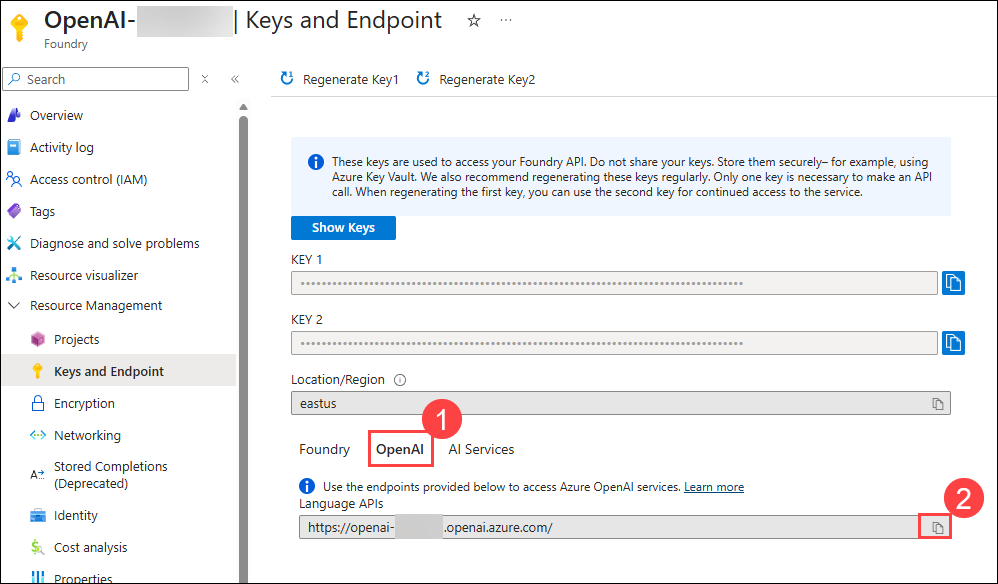
   
1. Next, collect the search service details. In the **Microsoft Foundry | AI Search** page, click **AI Search (1)**, and select **search-<inject key="Deployment ID" enableCopy="false"/> (2)**.

   

1. On the **Overview (1)** page, copy the **URL (2)**, and save it in the **Notepad** file.

   

1. Scroll down and, under **Security + networking**, click **Keys (1)**, copy the **Key (2)**, and save it in the **Notepad** file. You now have all four values needed for the deployment: the Foundry key and endpoint, and the Search URL and key.

   

1. Navigate back to **Visual Studio Code**. Click the **ellipsis (⋯) (1)** from the top menu bar, go to **Terminal (2)**, and select **New Terminal (3)** to launch a new terminal.

      

1. In the new terminal, run the command below to sign in to Azure. Signing in allows the Azure CLI to deploy resources into your lab subscription.

   ```
   az login
   ```

   

   >**Note**: Minimize all the applications to **Sign in**.

1. Select **Work or school account (1)**, and click **Continue (2)**.

   

1. On the **Sign in to Microsoft Azure** tab, you will see the login screen. Enter the following email/username, and click on **Next (2)**. 

   * **Email/Username:** <inject key="AzureAdUserEmail"></inject> **(1)**
   
      
     
1. Now enter the following password and click on **Sign in (2)**.
   
   * **Enter Temporary Access Pass:** <inject key="AzureAdUserPassword"></inject> **(1)**
   
      

1. On the **Sign in to all apps and websites on this device?**, click **No, this app only**.

      

1. In the Visual Studio code page, press **Enter** to select default subscription.

      

1. In the **Terminal**, you will now deploy the application infrastructure — including the App Service and Cosmos DB — using the provided ARM template. Copy the command below, and before running it, replace the placeholders with the values you saved in Notepad:

   | Placeholder                 | Replace with                                                    |
   | --------------------------- | --------------------------------------------------------------- |
   | **PASTE-RG-NAME**           | OpenAI-<inject key="Deployment ID" enableCopy="false"/>          |
   | **PASTE-FOUNDRY-ENDPOINT**  | The Foundry **Endpoint** you copied earlier                      |
   | **PASTE-FOUNDRY-KEY**       | The Foundry **Key 1** you copied earlier                         |
   | **PASTE-SEARCH-ENDPOINT**   | The AI Search **URL** you copied earlier                         |
   | **PASTE-SEARCH-KEY**        | The AI Search **Key** you copied earlier                         |

   ```
   az deployment group create --resource-group PASTE-RG-NAME --template-file infra/main.json --parameters deploymentId=<inject key="Deployment ID" enableCopy="false"/> appServiceSku=S1 azureOpenAiEndpoint=PASTE-FOUNDRY-ENDPOINT azureOpenAiApiKey=PASTE-FOUNDRY-KEY modelDeploymentName=completionModel searchEndpoint=PASTE-SEARCH-ENDPOINT searchApiKey=PASTE-SEARCH-KEY searchIndexName=azureblob-index
   ```

   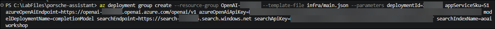

1. After the deployment completes, the output will be shown as below:

   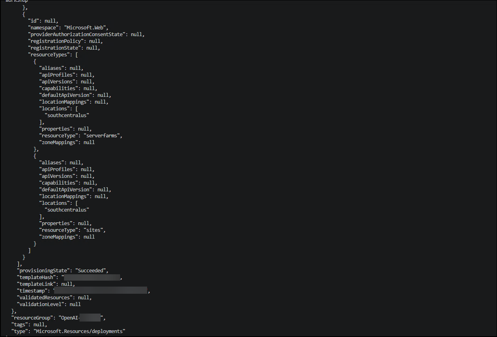

1. Next, collect the Cosmos DB connection details, which the application uses to store chat conversations. In the **Azure Portal**, enter **Azure Cosmos (1)** in the search bar, and then select **Azure Cosmos DB (2)**.

   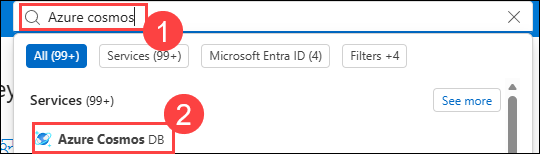

1. Open **cosmos-porsche-<inject key="Deployment ID" enableCopy="false"/>**, and copy the **URL (2)** into the **Notepad** file.

   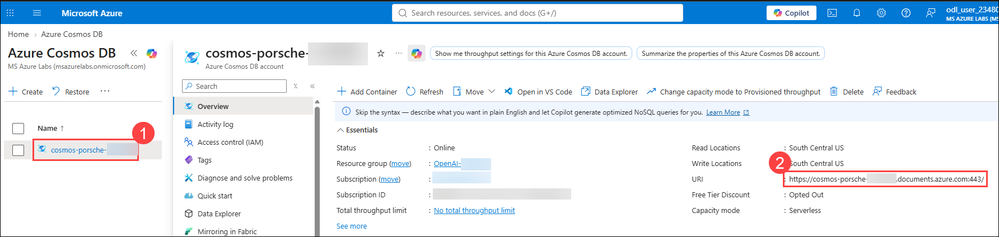

1. Scroll down and, under **Settings**, select **Keys (1)**. Copy the **Primary Key (2)** and paste it into **Notepad**.

   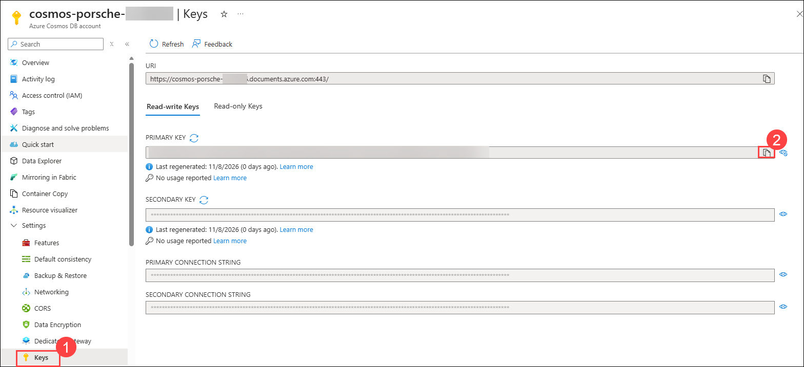

   >**Note**: Use the copied **URL** and **Primary Key** in the **.env.example** file by pasting them into the corresponding fields.

1. Back in Visual Studio Code, you will now configure the application's environment file with all the values you have collected. In the Explorer pane, click the dropdown next to **backend (1)** and select **.env.example (2)**. In this file, locate the settings that correspond to the values you previously copied into **Notepad** — the Foundry key and endpoint, the AI Search URL and key, and the Cosmos DB URL and Primary Key — and paste each value into its matching field.

   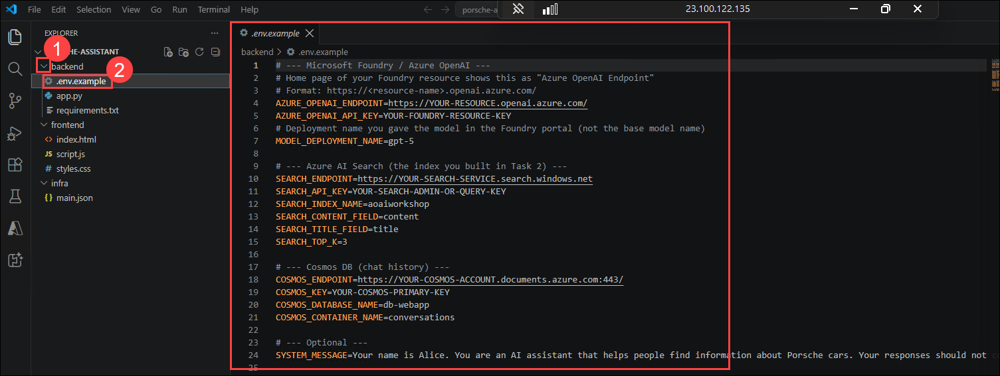

   - Additionally, update the following values in the **.env.example** file on lines **12** and **13**:
   - **SEARCH_INDEX_NAME** = azureblob-index
   - **SEARCH_CONTENT_FIELD** = analyzeResult/content
   - **MODEL_DEPLOYMENT_NAME** = completionModel

1. After updating all the values, the **.env.example** file should look similar to the following.

   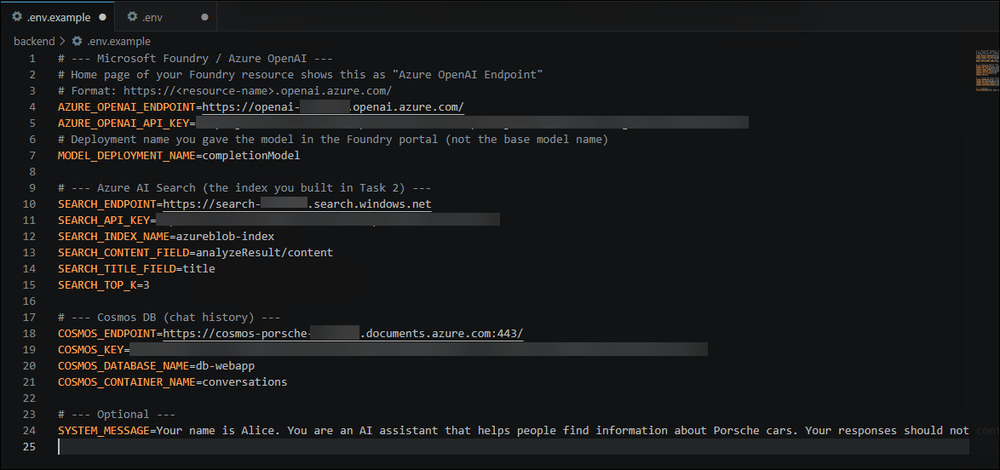

1. In the terminal, install the Python packages the application needs by running the following commands:

   ```
   cd .\backend\
   pip install -r requirements.txt
   ```

   >**Note**: Please wait until the installation is completed.

1. The output will be displayed as shown below:

   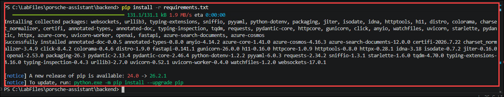

1. Copy the **.env.example** file to **.env** by running the command provided below. The application reads its configuration from the **.env** file at startup.

   ```
   copy .env.example .env
   ```

1. Now, start the application locally by running the command provided below. This launches the FastAPI backend using the **uvicorn** web server on port 8000:

   ```
   uvicorn app:app --reload --port 8000
   ```

1. You will get the output as below, indicating the application has started successfully:

   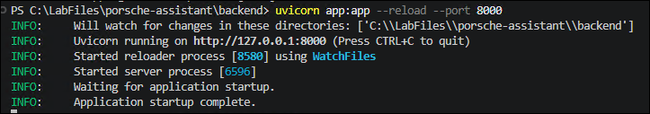

1. Browse to the application at `http://localhost:8000` in the browser, and explore the model by giving prompts such as the one below. The assistant answers using the indexed document data, confirming the local setup works end-to-end:

   ```
   How do I operate Android Auto?
   ```

   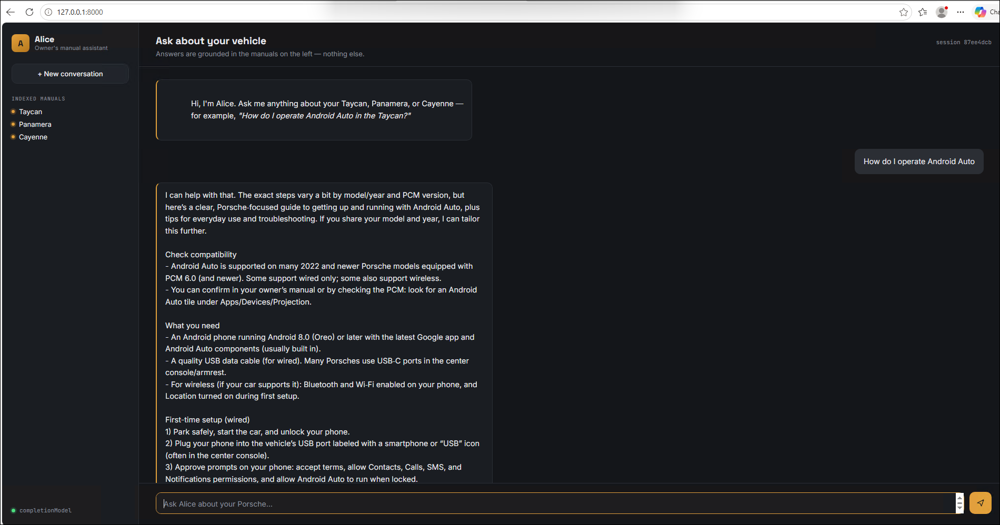

1. With the application verified locally, you will now deploy it to Azure App Service. On the left-hand side of Visual Studio Code, select **Azure (1)**, and if prompted to sign in to Azure, click **Sign in to Azure... (2)**.

   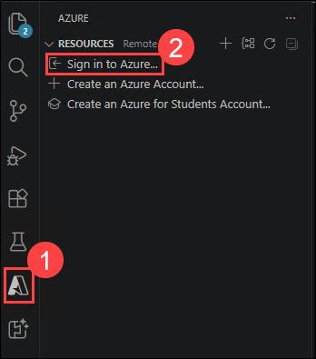

1. In the pop-up, click **Allow**.

   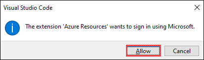

1. On the **Sign in to Microsoft Azure** tab, you will see the login screen. Enter the following email/username, and click on **Next (2)**.

   * **Email/Username:** <inject key="AzureAdUserEmail"></inject> **(1)**
   
      
     
1. Now enter the following password and click on **Sign in (2)**.
   
   * **Enter Temporary Access Pass:** <inject key="AzureAdUserPassword"></inject> **(1)**
   
      

1. On the **Sign in to all apps and websites on this device?**, click **No, this app only**.

      

1. In the Azure section of the Explorer pane, expand **Subscription (1)**, then expand **App Services (2)**. Right-click the **App Service (3)** created by your earlier deployment and select **Deploy to Web App... (4)**.

   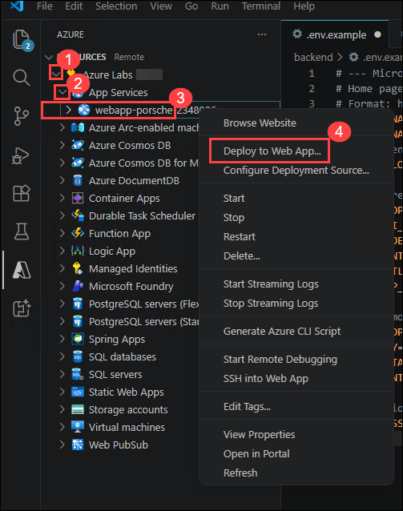

1. From the dropdown menu, select the **porsche-assistant** folder as the source to deploy.

   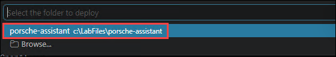

1. In the pop-up, click **Deploy** to confirm. Visual Studio Code packages the application and pushes it to the App Service.

   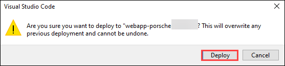

1. The output will be displayed as shown below once the deployment finishes:

   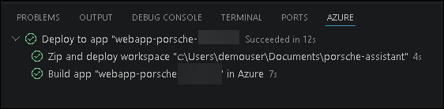

1. After the deployment, click **Stream Logs** to watch the App Service build and start the application in real time.

   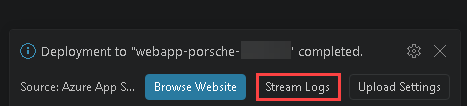

1. Once the output appears in the Logs window, browse to the Web App.

   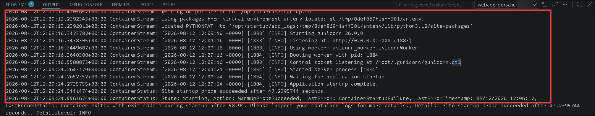
  
   >**Note:** Please wait 5–10 minutes for the deployment to complete successfully. Do not restart or interrupt the App Service session during this time, as doing so may affect the build process.

1. In the Azure Portal, search for **App Services (1)** in the search bar and select **App Services (2)** from the **Services** list.  

      

1. Select the **webapp-porsche-<inject key="Deployment ID" enableCopy="false"/> (1)** App Service.

      
      
1. Click **Browse** from the top menu bar to open the deployed application and verify that the web app is running successfully after deployment.

    
    
    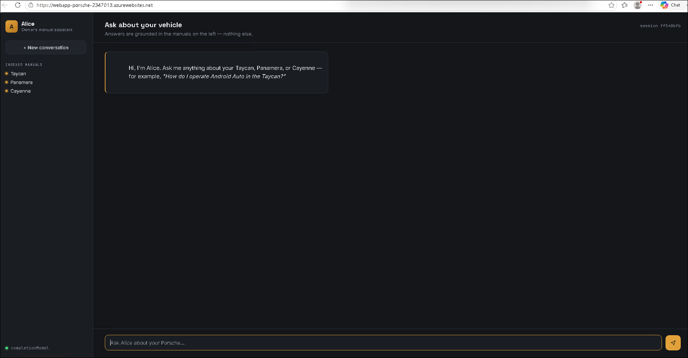

      > **Note:** If you see a blank screen, wait for some time and refresh the page.
   
      >**Note:** If the internal server issue continues, restart the web app and then try accessing it. Please note that it may take some time to become available.
     
1. Interact with the chatbot by entering queries related to the documents you previously uploaded, and verify that it responds with accurate, document-grounded answers:

   ```
   How do I operate Android Auto?
   ```

    

1. Finally, verify that the application is persisting conversations. In the Azure Portal, search for **Azure Cosmos DB (1)** and select **Azure Cosmos DB (2)** from the **Services** list.

    

1. Verify that **cosmos-porsche-<inject key="Deployment ID" enableCopy="false"/>** has been created, then **select** it.
   
   

1. In the **cosmos-porsche-<inject key="Deployment ID" enableCopy="false"/>** instance, navigate to **Data Explorer (1)** within your Azure Cosmos DB account. Expand the **conversations (2)** container and select **Items (3)**. Review the displayed **documents (4)** and confirm that the **conversation data (5)** from your web app interactions has been successfully recorded. Each item represents a stored chat exchange, giving Contoso a complete history of user conversations.

    
   
## Summary

In this lab, you accessed the Microsoft Foundry model, uploaded your own dataset, and integrated the data with the chat experience. You then interacted with the Microsoft Foundry chat model to generate responses grounded in the uploaded data.

## You have successfully completed the Hands-on lab.

### Conclusion

By completing this lab, you gained hands-on experience with Azure Microsoft Foundry to extend ChatGPT with your own data. You configured the system to respond to domain-specific queries, deployed the model as a web application, and validated that all interactions were successfully logged in Cosmos DB. This exercise demonstrated how to build, deploy, and monitor a customized AI-powered solution end-to-end.
