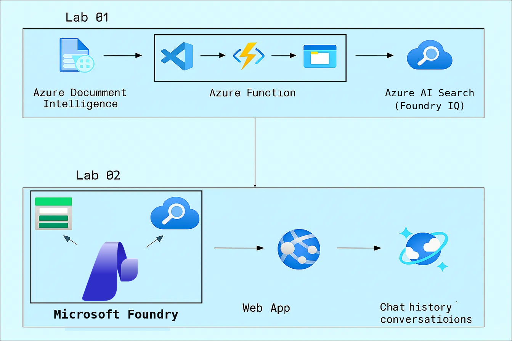
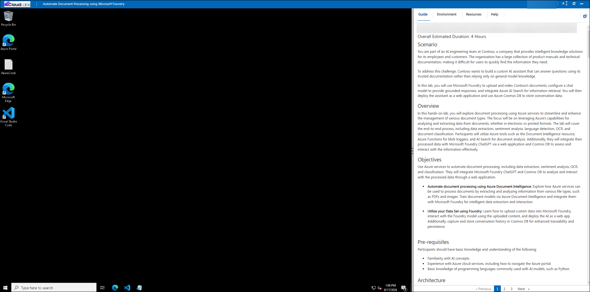
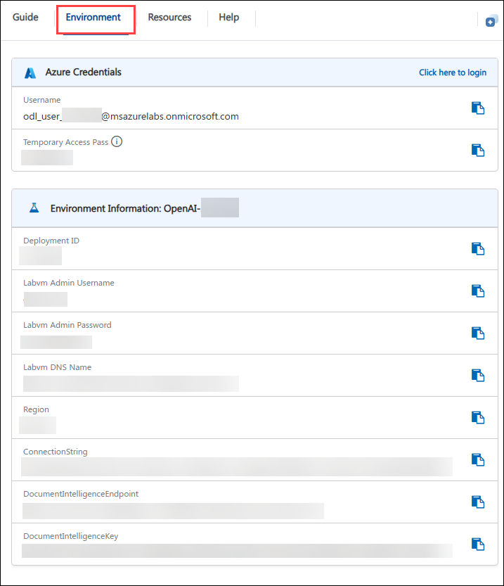
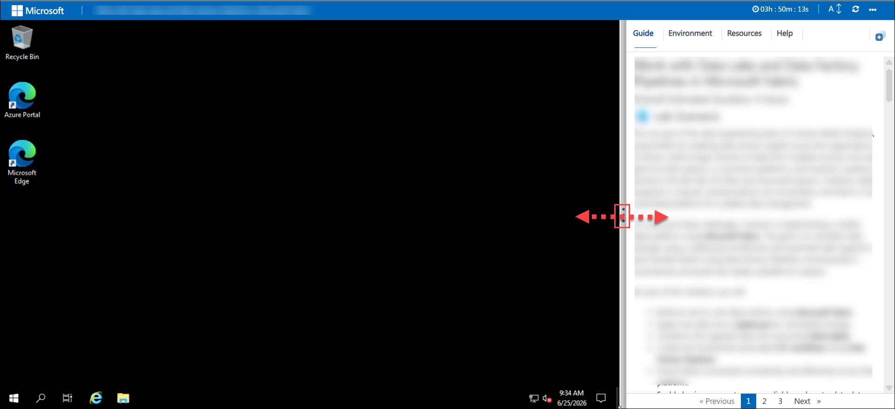

# Automate Document Processing using Microsoft Foundry

### Overall Estimated Duration: 4 Hours

## Scenario

You are part of an AI engineering team at Contoso, a company that provides intelligent knowledge solutions for its employees and customers. The organization has a large collection of product manuals and technical documentation, making it difficult for users to quickly find the information they need.

To address this challenge, Contoso wants to build a custom AI assistant that can answer questions using its trusted documentation rather than relying only on general model knowledge.

In this lab, you will use Microsoft Foundry to upload and index Contoso's documents, configure a chat model to provide grounded responses, and integrate Azure AI Search (Foundry IQ) for information retrieval. You will then deploy the assistant as a web application and use Azure Cosmos DB to store conversation data.

## Overview

In this hands-on lab, you will explore document processing using Azure services to streamline and enhance the management of various document types. The focus will be on leveraging Azure's capabilities for analyzing and extracting data from documents, whether in electronic or printed formats. The lab will cover the end-to-end process, including data extraction, sentiment analysis, language detection, OCR, and document classification. Participants will utilize Azure tools such as the Document Intelligence resource, Azure Functions for blob triggers, and AI Search (Foundry IQ) for document analysis. Additionally, they will integrate their processed data with Microsoft Foundry ChatGPT via a web application and Cosmos DB to assess and interact with the information effectively.

## Objectives

Use Azure services to automate document processing, including data extraction, sentiment analysis, OCR, and classification. They will integrate Microsoft Foundry ChatGPT and Cosmos DB to analyze and interact with the processed data through a web application.

- **Automate document processing using Azure Document Intelligence:** Explore how Azure services can be used to process documents by extracting and analyzing information from various file types, such as PDFs and images. Train document models via Azure Document Intelligence and integrate them with Microsoft Foundry for intelligent data extraction and interaction.

- **Utilize your Data Set using Foundry:** Learn how to upload custom data into Microsoft Foundry, interact with the Foundry model using the uploaded content, and deploy the AI as a web app. Additionally, capture and store conversation history in Cosmos DB for enhanced traceability and persistence.
  
## Pre-requisites

Participants should have basic knowledge and understanding of the following:

- Familiarity with AI concepts.
- Experience with Azure cloud services, including how to navigate the Azure portal.
- Basic knowledge of programming languages commonly used with AI models, such as Python.
  
## Architecture

**Azure Document Intelligence** processes and extracts data from documents. **Azure Functions** trigger the document processing based on blob changes. **Azure Storage Account** stores the documents to be processed. **Azure AI Search (Foundry IQ)** indexes and searches the extracted data. **Microsoft Foundry** provides AI capabilities for natural language processing and generation. **Web Application** facilitates user interaction and displays the results of the AI processing. A storage mechanism stores chat history for viewing and analysis.

## Architecture Diagram

## Explanation of Components

The architecture for this lab involves the following key components:

- **Azure Document Intelligence:** It is a service that uses AI to extract structured data from unstructured documents.
- **Azure Functions:** It is a serverless compute service that allows you to run code without having to provision or manage infrastructure. You can write code in various languages and trigger it based on events like HTTP requests, timers, or messages from queues or topics.
- **Azure AI Search (Foundry IQ):** It is a cloud-based search service that allows you to add search capabilities to your applications. It provides features like autocomplete, faceted search, and spell correction, making it easy for users to find relevant information.
- **Microsoft Foundry:** It is a unified platform for building, deploying, and managing AI applications using a range of AI models, including gpt-5 and later models. It enables developers to create intelligent applications that can understand natural language, generate human-like responses, analyze information, and interact with users using enterprise data and AI capabilities.
- **Azure Web App:** It is a fully managed platform for building, deploying, and scaling web applications. It supports various programming languages and frameworks, and offers features like continuous deployment, scaling, and integration with other Azure services.

## Getting Started with the Lab

Welcome to your Automate Document Processing using Microsoft Foundry workshop! We've prepared a seamless environment for you to explore and learn about Azure services. Let's begin by making the most of this experience.
 
## Accessing Your Lab Environment
 
Once you're ready to dive in, your virtual machine and guide will be right at your fingertips within your web browser.

  
 
## Virtual Machine & Lab Guide

Your virtual machine is your workhorse throughout the workshop. The lab guide is your roadmap to success.

## Exploring Your Lab Resources
 
To get a better understanding of your lab resources and credentials, navigate to the **Environment** tab.
 
  
 
## Utilizing the Split Window Feature
 
For convenience, you can open the lab guide in a separate window by selecting the **Split Window** button from the Top right corner.
 
  

## Managing Your Virtual Machine
 
Feel free to **Start, Restart,** or **Stop** your virtual machine as needed from the **Resources** tab. Your experience is in your hands!

  

## Lab Guide Zoom In/Zoom Out
 
To adjust the zoom level for the environment page, click the **A↕** icon located next to the timer in the lab environment.

  

## Resize the Virtual Machine View

Use the **slider (three vertical dots)** located between the **Virtual Machine** and the **Lab Guide** panes to adjust the display size, allowing you to customize the layout based on your preference.

## Let's Get Started with Azure Portal
 
1. On your virtual machine, click on the **Azure Portal** icon as shown below:
 
     .png)

1. On the **Sign in to Microsoft Azure** tab, you will see the login screen. Enter the following email/username, and click on **Next (2)**. 

   * **Email/Username:** <inject key="AzureAdUserEmail"></inject> **(1)**
   
      
     
1. Now enter the following password and click on **Sign in (2)**.
   
   * **Enter Temporary Access Pass:** <inject key="AzureAdUserPassword"></inject> **(1)**
   
      
     
1. If prompted to **Stay signed in?**, click **"No"**.
 
   

## Support Contact

The CloudLabs support team is available 24/7, 365 days a year, via email and live chat to ensure seamless assistance at any time. We offer dedicated support channels tailored specifically for both learners and instructors, ensuring that all your needs are promptly and efficiently addressed.

Learner Support Contacts:

- Email Support: cloudlabs-support@spektrasystems.com
- Live Chat Support: https://cloudlabs.ai/labs-support

Now, click on **Next >>** from the lower right corner to move on to the next page.
   

## Happy Learning!!